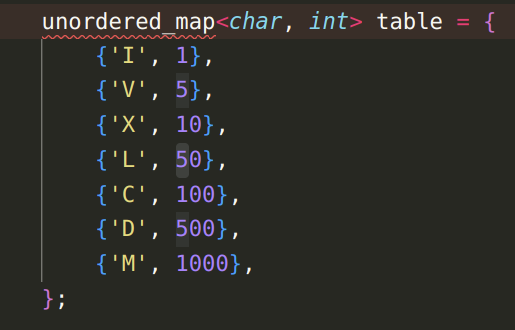
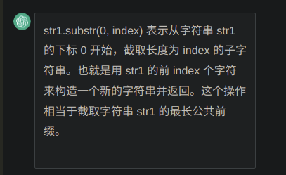
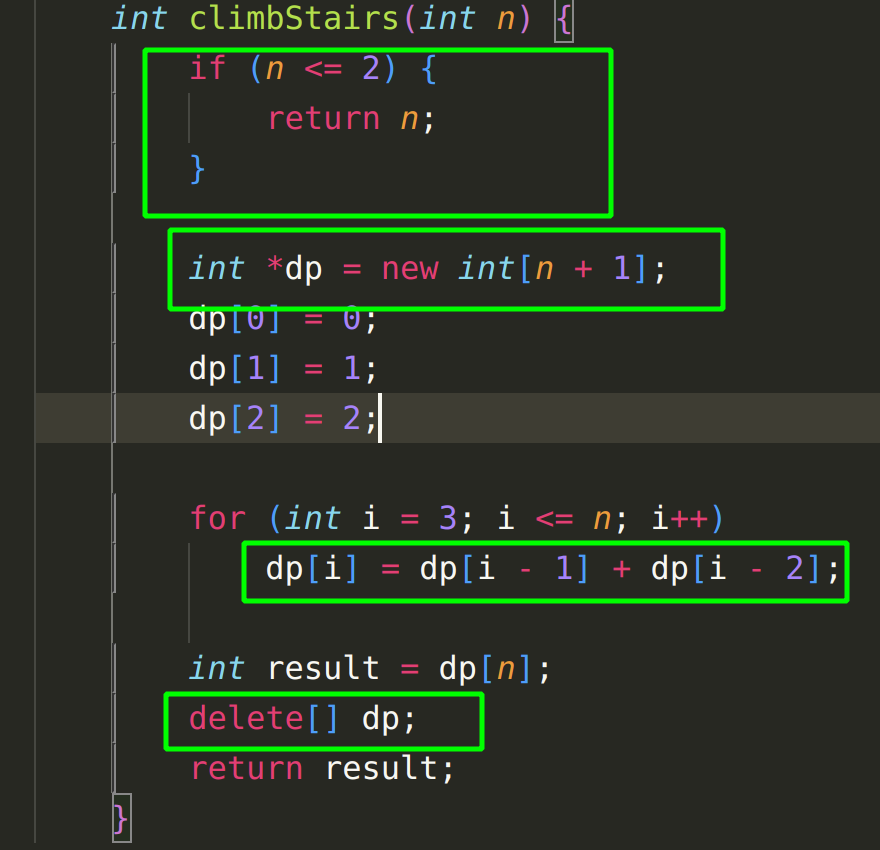
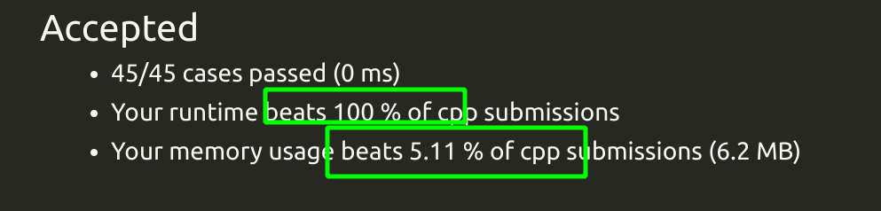
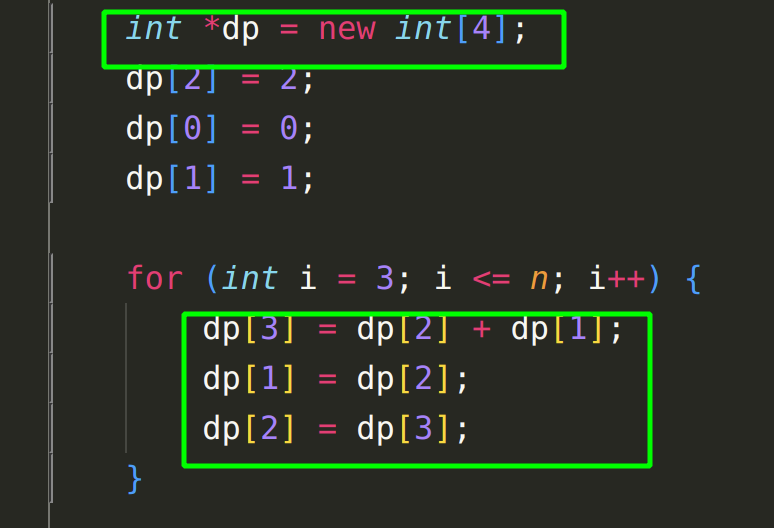
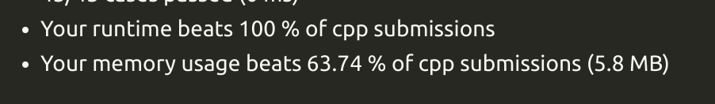

## 13.罗马数字转整数

分析数学关系
基础：查表，unordered map

## 14.最长公共前缀

横向扫描，如果字符串匹配，继续和下一个匹配
开始索引
函数重载
注意判断字符串是否为空
基础：字符串截取

## 20有效的括号

栈：为什么要用栈，因为可能存在括号嵌套
哈希表：为什么要用哈希表，因为要插括号匹配
逻辑找匹配：
如果先遇到右括号，那一定是不对的，返回false；如果已经遍历了一会，再遇到右括号，则把栈顶弹出
如果先遇到左括号，那应该压入栈，等着找右括号

最后判断的条件是，stack中还有没有元素，如果有的话，肯定是还剩下有没匹配的
基础：stack：
定义，弹出，只能访问栈顶元素

## 21.合并两个有序链表

递归
首先预处理，考虑极端情况
分解子问题，递归处理

## 26.删除有序数组中的重复项

双指针
快慢指针，快指针用来移动，慢指针用来写入

# 35.搜索插入位置

条件化简为：在一个有序数组中找第一个大于等于 target 的下标

## 58.最后一个单词的长度

反向遍历
从数组末尾开始遍历，先用while(--)把空格去掉
然后再用while(--)把字符拿出来
注意边界情况，index应该是大于等于0

## 66.加一

反向遍历
分析数学关系

## 70 爬楼梯

状态转移方程：
d[n] = dp[n-1]+dp[n-2]

C++开辟新数组：
int *dp = new int[n + 1];
dp[0] = 0;

基本方法：

开辟了n+1的地方，空间复杂度高

改进：
滚动数组：

## 83.删除排序链表中的重复元素

因为链表中自带指针，所以不需要双指针
一次遍历
首先判断整个链表是不是空的
防止越界，判断到current->next就可

## 206 反转链表

1.双指针

cur prev
cur <-prev