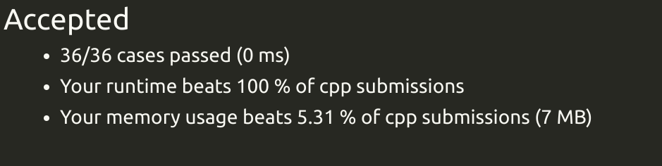
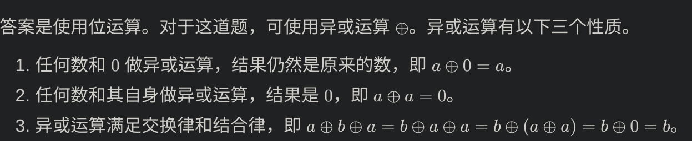

## 13.罗马数字转整数

分析数学关系
基础：查表，unordered map

## 14.最长公共前缀

横向扫描，如果字符串匹配，继续和下一个匹配
开始索引
函数重载
注意判断字符串是否为空
基础：字符串截取

## 20有效的括号

栈：为什么要用栈，因为可能存在括号嵌套
哈希表：为什么要用哈希表，因为要插括号匹配
逻辑找匹配：
如果先遇到右括号，那一定是不对的，返回false；如果已经遍历了一会，再遇到右括号，则把栈顶弹出
如果先遇到左括号，那应该压入栈，等着找右括号

最后判断的条件是，stack中还有没有元素，如果有的话，肯定是还剩下有没匹配的
基础：stack：
定义，弹出，只能访问栈顶元素

## 21.合并两个有序链表

递归
首先预处理，考虑极端情况
分解子问题，递归处理

## 26.删除有序数组中的重复项

双指针
快慢指针，快指针用来移动，慢指针用来写入

# 35.搜索插入位置

条件化简为：在一个有序数组中找第一个大于等于 target 的下标

## 58.最后一个单词的长度

反向遍历
从数组末尾开始遍历，先用while(--)把空格去掉
然后再用while(--)把字符拿出来
注意边界情况，index应该是大于等于0

## 66.加一

反向遍历
分析数学关系

## 70 爬楼梯

状态转移方程：
d[n] = dp[n-1]+dp[n-2]

C++开辟新数组：
int *dp = new int[n + 1];
dp[0] = 0;

基本方法：

开辟了n+1的地方，空间复杂度高

改进：
滚动数组：

## 83.删除排序链表中的重复元素

因为链表中自带指针，所以不需要双指针
一次遍历
首先判断整个链表是不是空的
防止越界，判断到current->next就可

## 206 反转链表

* 将 next 指针指向当前节点的下一个节点，避免链表的断裂；
* 将当前节点的 next 指针指向 prev，实现节点的反转；
* 将 prev 指针指向当前节点，为下一轮循环做好准备；
* 将 cur 指针指向 next，继续遍历。
  遍历完毕后，prev 指向新的头节点，即反转前原来的尾节点。

## 100.相同的树

深度优先搜索:
中止条件：当前节点不是null时，去访问左节点和右节点
    分情况处理：左右都是null，返回相等
    左右有一个是Null，另一个不是null，返回不等
    左右都不是null，并且左右值相等，并且左右值的子树相等，返回相等（这一步是迭代，迭代的中止条件是当前访问的节点是不是Null）
BFS：
  一层一层遍历
  对于每一个节点，比较他的左和右与另一个是否相等
  用两个队列装左子树和右字数
  1.比较两个节点的值，如果不相等，则中止，如果相等，则判断他的子节点是否相等
  2.各自取他的左右子节点，如果子节点结构不一样，则中止
  3.如果结构一样，则将子节点加入队列

  总体来说，是横着处理的

## 101.对称二叉树

递归：和100一样，只不过是判断的是right=?left
迭代：用队列模拟

## 104.二叉树的最大深度

DFS:
要找最大深度，就是找max（left,right）+1
递归求解
中止条件：当前节点为空,就返回0

BFS:
把每一层的节点都放入queue，遍历完这一层，depth+1
每次拓展下一层的时候，我们需要将队列里的所有节点都拿出来进行拓展，这样能保证每次拓展完的时候队列里存放的是当前层的所有节点，即我们是一层一层地进行拓展，最后我们用一个变量来维护拓展的次数，该二叉树的最大深度即为。

## 108.将有序数组转换为二叉搜索树

二叉搜索树，BST
BST的中序遍历是升序的，所以问题转化为根据BST的中序遍历恢复一颗高度平衡BST
思路：
以升序数组中的任意一个元素作为根节点，以该元素左边的升序序列构建左子树，以该元素右边的升序序列构建右子树，这样可以得到一颗BST
因为需要高度平衡，所以需要选择中间的元素作为根节点
构建过程只和index有关，和数据无关，因为升序数组解决了这个事情
递归：
1.空指针直接返回
2.寻找中间值mid，创建新节点
3.新节点左孩子指向遍历，遍历[left,mid-1]
3.新节点右孩子指向遍历，遍历[mid+1,left]

迭代:
1.创建三个队列，保存节点，左下标和右下标
2.节点队列弹出元素，左右下标队列弹出元素，当前节点赋值中间值，检查左右下标是否还能创建树节点

## 876.链表的中间结点

1.把链表变成数组，空间比较大
2.单指针，先用单指针算下链表有多少个节点，然后算下中间的点，返回中间链表节点。注意保护头指针

3.双指针，快指针走两步，慢指针走一步，当快指针到末尾的时候，慢指针肯定在中间
Your runtime beats 100 % of cpp submissions
Your memory usage beats 63.61 % of cpp submissions (6.8 MB)

迭代：

## 109.有序链表转换二叉搜索树

有序数组变成了链表，可以一种笨办法先把链表变成有序数组
Your runtime beats 11.99 % of cpp submissions
Your memory usage beats 11.86 % of cpp submissions (28 MB)

用快慢指针找到链表的中位数，以该中无数为根节点，将中位数左右两边分成两个有序子链表

## 110.平衡二叉树

自顶向下
具体做法类似于二叉树的前序遍历，即对于当前遍历到的节点，首先计算左右子树的高度，如果左右子树的高度差是否不超过 1，再分别递归地遍历左右子节点，并判断左子树和右子树是否平衡。
这是一个自顶向下的递归的过程。

自底向上
自底向上递归的做法类似于后序遍历，对于当前遍历到的节点，先递归地判断其左右子树是否平衡，再判断以当前节点为根的子树是否平衡。如果一棵子树是平衡的，则返回其高度（高度一定是非负整数），否则返回 -1−1。如果存在一棵子树不平衡，则整个二叉树一定不平衡。

## 111.二叉树的最小深度

DFS：
递归结束条件：该节点的左右节点都是null
找左右枝的叶子节点，比较哪个len小，取了+1

BFS:

## 112.路径总和

//BFS:

// DFS

## 125.验证回文串

// 筛选+判断
把字母和数字筛选出来，同时把字母变成小写组成字符串
然后把字符串翻转过来
判断翻转前后是否相等

双指针
把字母和数字筛选出来，同时把字母变成小写组成字符串
判断首位是否相等

## 136.只出现一次的数字

位运算

哈希表??

## 141.环形链表

哈希表
用unordered_map数据结构，该结构只允许插入元素一次，无序
插入元素：insert(num);
查找改元素是否存在：count(num);

双指针
特殊判断条件：
head==nullptr,head->next==nullptr
初始化条件：slow和fast不能相等，所以一开始初始化的时候也不能相等

如果链表中存在环，快慢指针一定会相遇
循环条件：快慢指针相遇
结束条件：fast==nullptr || fast->next==nullptr

## 94.二叉树的中序遍历

递归：
中序遍历：
递归公式 Preorder(node) = Preorder(node->left)->print node->preorder(node->right)
中止条件：node是否为空，为空则返

迭代
用stack把递归的过程模拟出来

## 144.二叉树前序遍历

前序遍历：
递归公式：Preorder(node) = print node->Preorder(node->left)->preorder(node->right)
中止条件：node是否为空，为空则返回
递归过程：

迭代：
这里需要注意的是右节点应优先入栈
这是由于栈的先进后出特点，以及前序遍历：根->左->右的顺序
右节点先入栈，那么我们优先遍历左节点，自然就得到前序遍历的正确顺序

## 145.二叉树后序遍历

后序遍历：
递归公式：Preorder(node) =  node->Preorder(node->left)->preorder(node->right)-》print

## 102.二叉树层序遍历