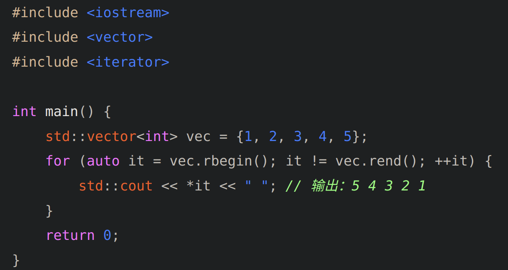

### isalnum

函数用于判断字符是否为字母（a-z和A-Z）或数字（0-9）

### tolower

变小写

### reverse_copy

将一个字符串复制到另一个字符串，并同时翻转它

```cpp

string s1;
string s2(s1.size(), ' ');
reverse_copy(s1.begin(), s1.end(), s2.begin());
```

### rbegin,rend

rbegin() 和 rend() 是 C++ STL 中的成员函数，它们用于获取容器反转迭代器的起始和结束位置。

rbegin() 返回一个逆向迭代器，指向容器中最后一个元素。对这个迭代器执行自增运算符 ++，迭代器会移动到容器中倒数第二个元素，以此类推。
rend() 返回一个逆向迭代器，它指向容器的第一个元素所在的位置之前的一个位置。

翻转字符串
string sgood_rev(sgood.rbegin(), sgood.rend())
逆序输出
